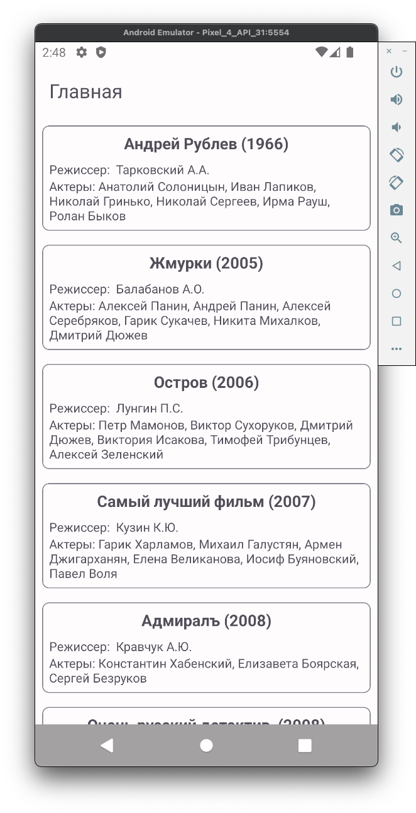
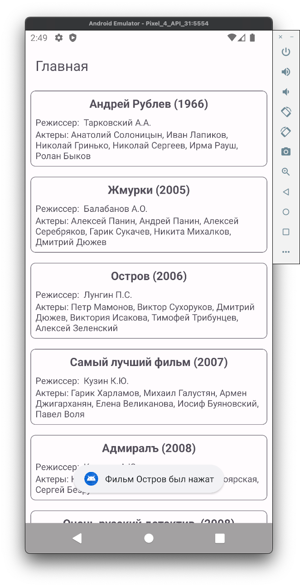
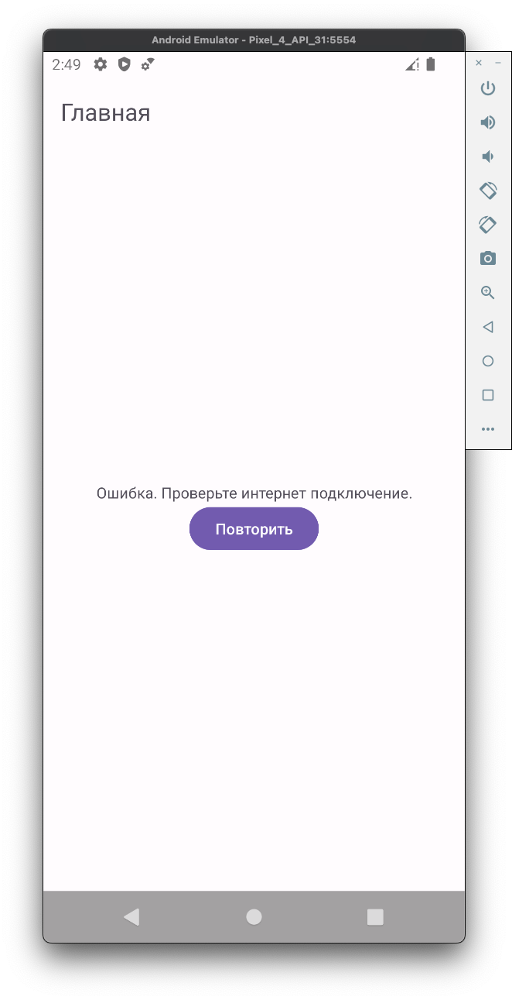

<h2> Тестовое задание для "CONSTANTA" </h2>

<h2>Apk находится в папке additional_data/apk/</h2>

<b>Примеры экранов:</b>

  

<b>Используемые технологии:</b>

- Kotlin
- MVVM + States
- Kotlin coroutines + Flow
- Retrofit, GSON
- KOIN
- Cicerone

  <b> Задание: ([ссылка](https://github.com/constanta-android-dev/intership-wellcome-task/tree/main)) </b>